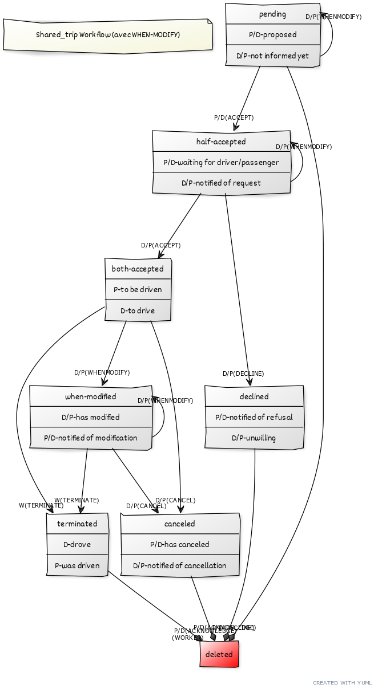

# YackUnivOrlBack
Backend repo

Comment utiliser ce repo :

Ce repo vous permet de constituer l'environnement de développement où vous pourrez ajouter des fonctionnalités à l'API de Yacka. Pour éviter de vous submerger de détails, c'est une version réduite de l'API réelle, limitée aux fonctionnalités nécessaires sur lesquelles appuyer votre travail.

Le repo contient majoritairement du code python. Il repose sur le framework Flask, qui procure les outils facilitant le développement d'API (routage, authentification, décryptage des requêtes et envoi de réponses aux formats adaptés, etc.). On utilise également SQL Alchemy et sa déclinaison Flask (Flask-SQLAlchemy) comme moyens de converser avec la base de données MySQL.

Outre les différents fichiers de configuration, le repo contient les 3 parties qu'on retrouve dans beaucoup de serveurs backend : la définition des modèles de données, les contrôleurs, et le service ("l'intelligence") derrière ces derniers. Dans certaines architectures les parties service et contrôleur ne font qu'une, et on trouve une partie "vues". Ici la partie "vues" est plutôt à chercher dans un fichier nommé dto.py (répertoire app/main/util) qui sert de filtre vers le frontend.
  
Pour utiliser le repo il vous faudra le clôner sur votre machine locale avec git, puis créer une ou plusieurs branches locales dans lesquelles vous développerez vos fonctionnalités (process classique git) :
  
  ```shell
  $ git clone git@github.com:yackateam/YackUnivOrlBack.git
  $ git checkout -b nom-de-la-nouvelle-branche
  $ cd YackUnivOrlBack
  ```
 
Une fois le repo clôné et depuis votre nouvelle branche, il vous faudra, sur votre machine locale, installer les différents modules python nécessaires (vous devez avoir auparavant installé python 3.7.11 sur votre machine (si vous utilisez des environnements virtuels, vérifiez que cette version est installée et basculez en python 3.7.11) :
  
  ```shell
  $ pip install -r install/reqs.txt
  ```
Il vous faudra ensuite initialiser la base de données et l'arborescence de migration de Flask-SQLAlchemy, puis peupler cette base, en lançant le script :
  
  ```shell
  $ sh ./install/db-init-and-populate.sh
  ```
Celui-ci charge la base avec une organisation, des utilisateurs (tous rattachés à cette organisation), des trajets, des partages de trajets déjà créés et qu'on a fait évoluer comme ils pourraient évoluer dans la réalité. Attention : les 4 premières lignes de commande mysql peuvent devoir être modifiées selon votre configuration locale de mysql. Tout le monde n'aime pas utiliser sudo mysql, à commencer par moi, j'utilise plutôt mysql -u <priviledged_user> -p ... A vous de voir, demandez-moi en cas de doute.
  
Pour que Flask sache que vous vous référez à la bonne application, et donc pour que vous puissiez utiliser les commandes en ligne que Flask met à votre disposition (flask shell, flask db ...), vous devez toujours avoir dans votre environnement linux les variables ainsi initialisées :
  
  ```shell
  $ export FLASK_APP="app/yacka.py"; export FLASK_DEBUG=1; export FLASK_ENV="local"
  ```
Le repo contient plusieurs utilitaires qui vous permettront d'obtenir des infos de la base de données et de faire des modifications dans celle-ci (et vous serez peut-être amenés à en développer pour vos tests, selon la manière dont vous organisez ceux-ci). Par exemple, pour connaître la liste des utilisateurs auxquels il correspond au moins un shared_trip à l'état "both-accepted", vous pouvez lancer :

  ```shell
  $ flask test list_users_with_one_shared_trip --arg=both-accepted
  ```
Cette commande vous donne les identifiants des utilisateurs concernés, ce qui est bien pratique pour se connecter à l'appli, une fois que vous aurez configuré le frontend.

Tous les utilisateurs enregistrés dans la base ont le même mdp : YackUnivOrlPass
  
L'identifiant de l'organisation auxquels appartiennent ces utilisateurs est testco@yacka.fr. Il a le même mdp que les utilisateurs.

Pour lancer l'API, il faut faire :

  ```shell
  $ flask run
  ```
qui lance un serveur http sur votre machine locale et permet d'écouter le frontend sur le port localhost:5000.
  
Lorsque vous ajouterez des modèles dans l'API ou que vous ferez des modifs à des modèles existants (ce second cas étant rare a priori), vous devrez, pour répercuter ces changements dans la structure de la base de données (et donc pour que ces modifs soient utilisables), lancer deux commandes :
  
  ```shell
  $ flask db migrate -m "message explicatif"
  $ flask db upgrade
  ```
Ces modifs doivent bien sûr être coordonnées entre vos différentes branches. Si certains font des modifs de structure de la base, travaillent sur des fonctionnalités, pendant que d'autres en développent d'autres reposant sur une structure différente, même s'il n'y a pas de merge conflict entre le code, il y en aura un au lancement de l'app... 
  
Enfin, voici le workflow d'un shared_trip :


Bon code !
  
